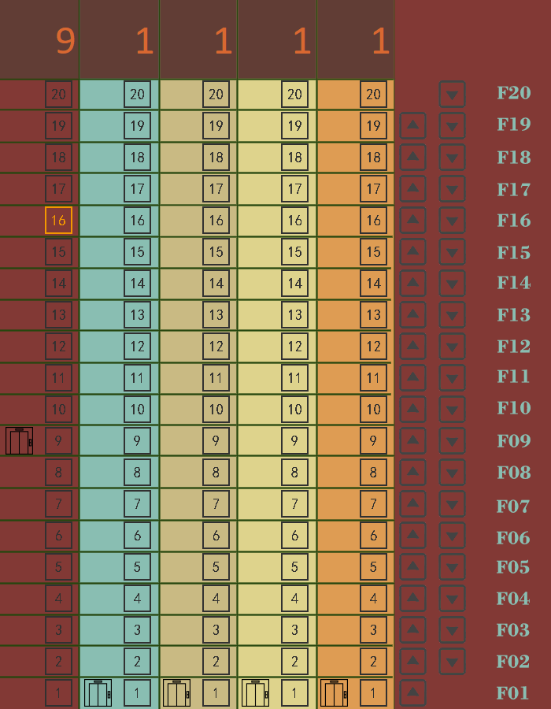
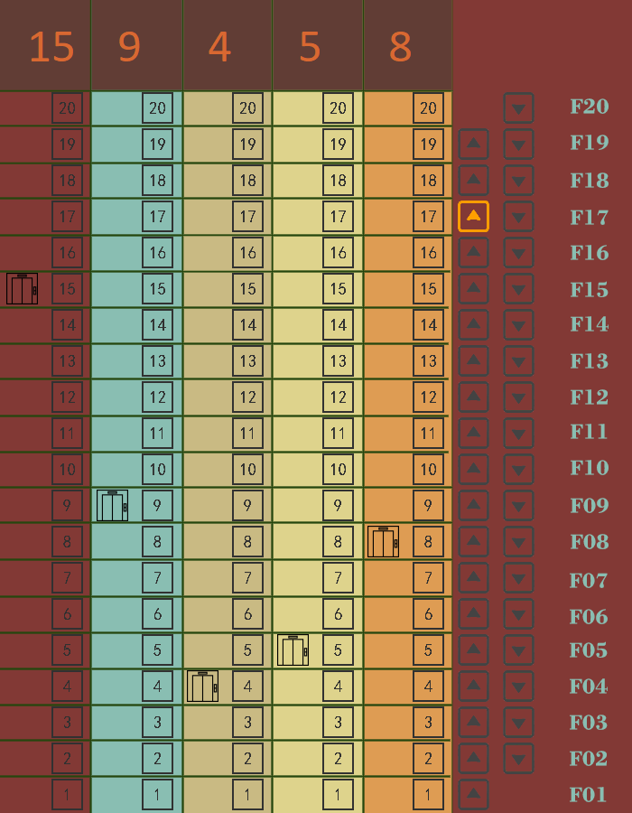
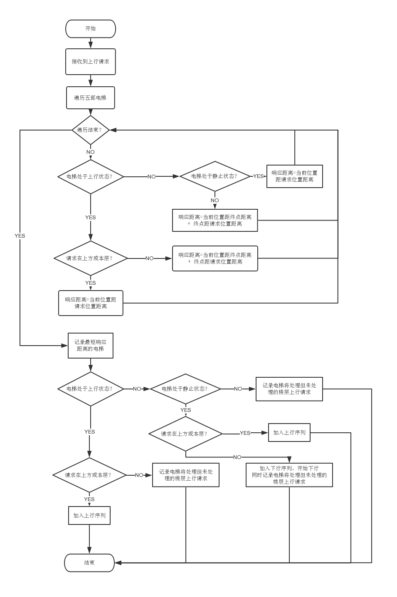
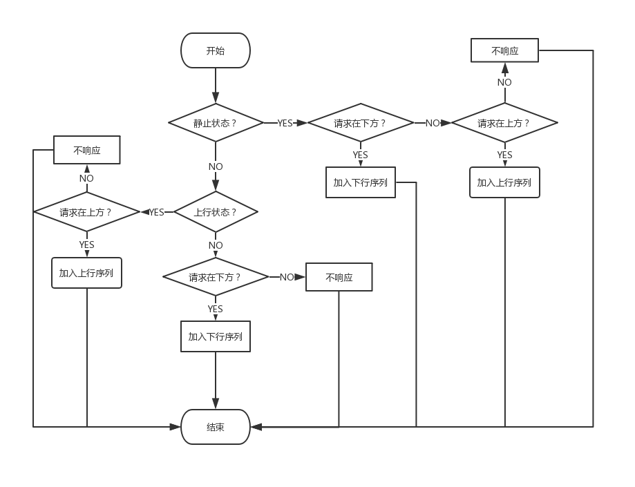
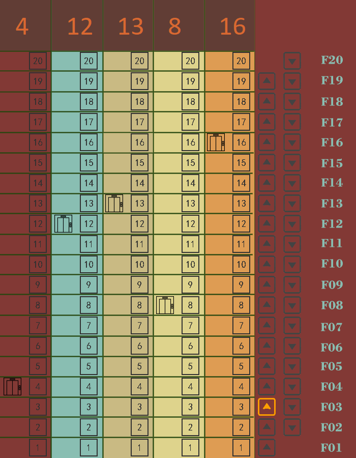
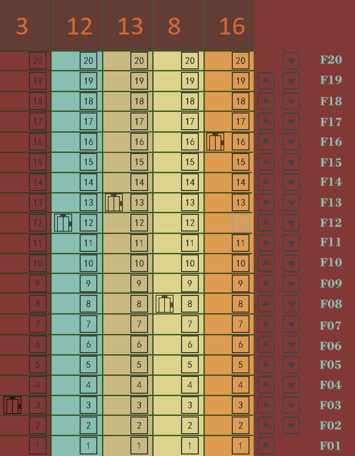
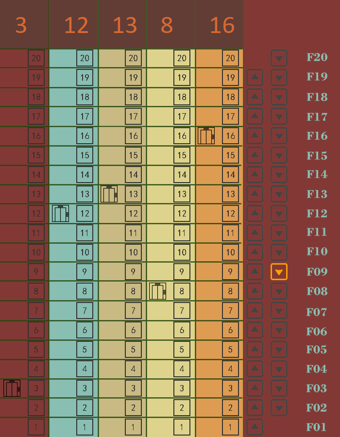
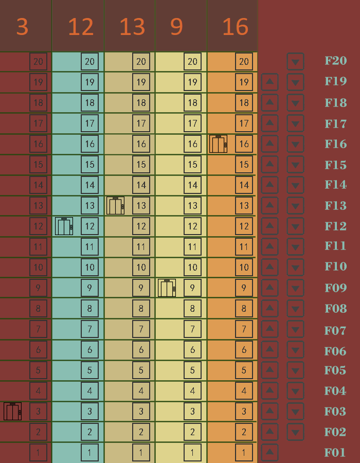
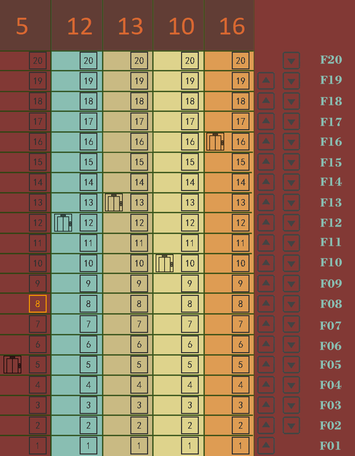
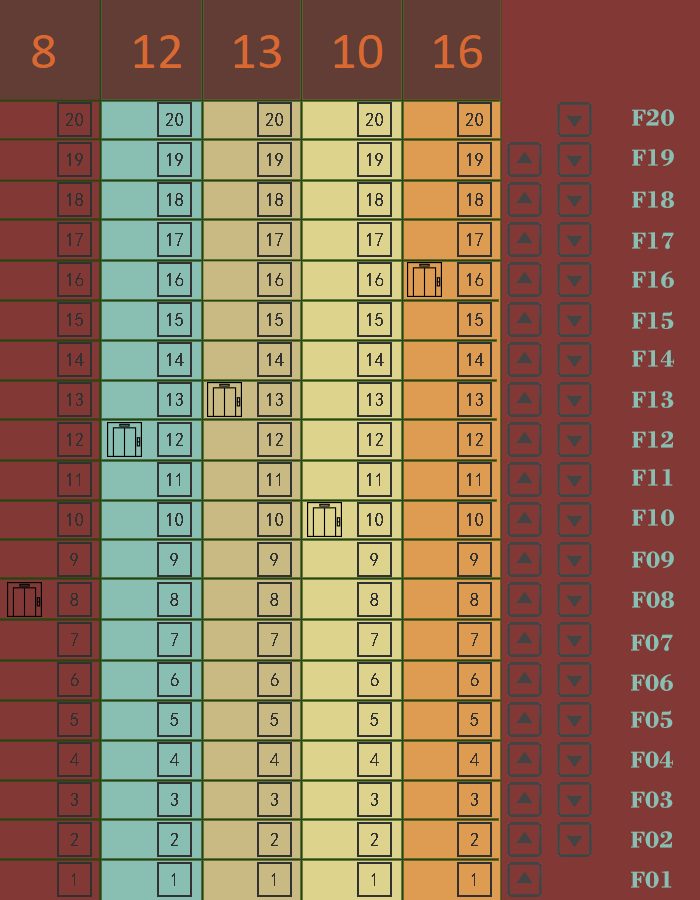

# 1. 使用说明

## 1.1 项目简介

电梯作为人们出行的重要工具之一，在人们日常生活中扮演着重要的角色。而电梯的调度算法是决定电梯运行效率的关键，一个高效的调度算法对电梯能否有效地运行起到重要的作用。因此，设计一套良好的调度算法具有十分重要的意义。

## 1.2 项目目的

1.2.1 学习调度算法

1.2.2 通过实现电梯调度，体会操作系统调度过程

1.2.3 学习特定环境下多线程编程方法

## 1.3 项目功能要求

### 1.3.1 基本任务

  某一层楼20层，有五部互联的电梯。基于线程思想，编写一个电梯调度程序。

### 1.3.2 功能描述

每个电梯里面设置必要功能键：如数字键、关门键、开门键、上行键、下行键、报警键、当前电梯的楼层数、上升及下降状态等。

每层楼的每部电梯门口，应该有上行和下行按钮和当前电梯状态的数码显示器。

五部电梯门口的按钮是互联结的，即当一个电梯按钮按下去时，其他电梯的相应按钮也就同时点亮，表示也按下去了。

所有电梯初始状态都在第一层。每个电梯如果在它的上层或者下层没有相应请求情况下，则应该在原地保持不动。

调度算法自行设计

## 1.4 操作手册

### 1.4.1 数字键

每部电梯中都设有1-20的数字键，点击数字键，电梯到达指定楼层。如图操作：



### 1.4.2 上下行健


每个楼层设有上行和下行键，点击上下行健，所有电梯都会接收到请求，调度算法进行调度，安排电梯到达该楼层，如图操作：




# 2. 程序设计与实现

## 2.1 设计

### 2.1.1开发环境及语言

开发环境：pycharm

开发语言：python

本项目采用PyQt5实现图形化用户界面，达到电梯调度可视化的目的。

### 2.1.2 算法设计

#### 对于**单部电梯**采用**LOOK算法**：

​	先讨论**最短寻找楼层时间优先算法（SSTF）**：

​	最短寻找楼层时间优先（SSTF-Shortest Seek Time First）算法，它注重电梯寻找楼层的优化。

​	最短寻找楼层时间优先算法选择下一个服务对象的原则是最短寻找楼层的时间。

​	这样请求队列中距当前能够最先到达的楼层的请求信号就是下一个服务对象。

​	在重载荷的情况下，最短寻找楼层时间优先算法的平均响应时间较短，但响应时间的方差较大，原因是队列中   的某些请求可能长时间得不到响应，出现所谓的“饿死”现象。


​	再讨论**扫描算法（SCAN）**：

​	**扫描算法（SCAN）**

​	扫描算法（SCAN） 是一种按照楼层顺序依次服务请求，它让电梯在最底层和最顶层之间连续往返运行，在运行过程中响应处在于电梯运行方向相同的各楼层上的请求。

​	它进行寻找楼层的优化，效率比较高，但它是一个非实时算法。扫描算法较好地解决了电梯移动的问题，在这个算法中，每个电梯响应乘客请求使乘客获得服务的次序是由其发出请求的乘客的位置与当前电梯位置之间的距离来决定的。

​	所有的与电梯运行方向相同的乘客的请求在一次电向上运行或向下运行的过程中完成，免去了电梯频繁的来回移动。

​	扫描算法的平均响应时间比最短寻找楼层时间优先算法长，但是响应时间方差比最短寻找楼层时间优先算法小，从统计学角度来讲，扫描算法要比最短寻找楼层时间优先算法稳定。


​	而**LOOK算法**是对**扫描算法**的一种改进算法：

​	对LOOK算法而言，电梯同样在最底层和最顶层之间运行。

​	但当 LOOK 算法发现电梯所移动的方向上不再有请求时立即改变运行方向，而扫描算法则需要移动到最底层或者最顶层时才改变运行方向。

​	比较多种算法，要避免“饿死”现象，且最大限度地缩短平均响应时间，提高稳定性，考虑采用**LOOK算法**

​	【参考：我猜，每个程序员对着电梯都想过调度算法吧！ <https://blog.csdn.net/gitchat/article/details/80202416>】

#### 在单部电梯LOOK算法的基础上，对于多部电梯寻求最短时间调度：

对于每部电梯，为其设计一对上下行序列数组，其中上行序列数组正序排列，下行序列数组倒序排列，电梯根据目前状态以及两数组中内容执行动作。

当某楼层有上行或下行请求发出时，先考虑每部电梯在完成当前序列的过程中能否响应该请求，计算出符合此条件的电梯的响应距离，再考虑剩余电梯从其当前位置到序列终点与终点到该请求位置的响应距离之和，最后比较每部电梯的响应距离，将该请求分配给具有最短响应距离一部电梯。

### 2.1.3 数据结构设计

本项目要求对每部电梯的状态进行实施监测，需要存储电梯的运行状态，且每部电梯还需要有对应的调度命令，采用python内置的list以及dictionary来存储数据。

### 2.1.4 类结构设计

①UI类

```python
class Ui_MainWindow(object):
```

​	类成员：

```python
def setupUi(self, MainWindow): # 设置主窗口UI，加载所需的背景，button以及Label
```

②调度类

```python
class elevator_schedul():
```

​    类成员：

​		属性：

```python
		self.isUp = {}  # 电梯上行标志数组
        self.isDown = {}  # 电梯下行标志数组
        self.last_isUp = {}  # 电梯前一次上行标志数组
        self.last_isDown = {}  # 电梯前一次下行标志数组
        self.location = {}  # 电梯所在层数数组
        self.upfloor = [[0] * 21 for i in range(6)]  # 记录某电梯将处理但未处理的楼层上行请求
        self.downfloor = [[0] * 21 for i in range(6)]  # 记录某电梯将处理但未处理的楼层下行请求
        self.upSequence = [[] for i in range(6)]  # 电梯上行序列数组
        self.downSequence = [[] for i in range(6)]  # 电梯下行序列数组
```

​		方法：

```python
		# 监听上行按钮
    	def upbutton_listen(self, btn_number):
            
        # 监听下行按钮
    	def downbutton_listen(self, btn_number):
            
        # 监听电梯楼层数字按钮，elevator_number:电梯序号，btn_number:按钮楼层号
    	def numberbtn_listen(self, elevator_number, btn_number):
            
        # 创建线程
    	def thread(self, elevator_number):
            
 		# 加载上行序列动画
    	def elevator_up_anim(self, elevator_number):
            
        # 加载下行序列动画
    	def elevator_down_anim(self, elevator_number):
            
        # 执行完上行动作恢复静止后，处理执行动作时产生的但未处理的请求
    	# 此时执行动作时产生的但未处理的下行请求可能在任意位置，但执行动作时产生的但未处理的上行请求只可能在下方
    	def elevator_finish_up(self, elevator_number):
            
        # 执行完下行动作恢复静止后，处理执行动作时产生的但未处理的请求
    	# 此时执行动作时产生的但未处理的上行请求可能在任意位置，但执行动作时产生的但未处理的下行请求只可能在上方
    	def elevator_finish_down(self, elevator_number):
            
        # 每趟动画执行完后，对该趟动画执行时产生的未能执行的数据进行处理
    	def finish_anim(self, elevator_number):
            
        # 加载电梯动画
    	def elevator_anim(self, elevator_number):	
```

③主窗口界面类

```python
class myWindow(QtWidgets.QMainWindow):
```

​	类成员：

```python
		self.ui = Ui_MainWindow()  # 创建UI
        self.ui.setupUi(self)      # 设置UI
        self.schedul = elevator_schedul(self.ui)  # 创建调度逻辑
```

## 2.2 主要功能实现

### 2.2.1 监听上下行按钮【以上行为例】



### 2.2.2 监听数字按钮



### 2.2.3 执行完上下行动作恢复静止后，处理执行动作时产生的但未处理的请求【以上行为例】


```python
# 此时执行动作时产生的但未处理的下行请求可能在任意位置，但执行动作时产生的但未处理的上行请求只可能在下方
    def elevator_finish_up(self, elevator_number):
        i = 20
        while i >= 1:  # 倒序处理执行动作时产生的但未处理的下行请求
            if self.downfloor[elevator_number][i] == 1:
                if i > self.location[elevator_number]:  # 上方存在执行动作时产生的但未处理的下行请求
                    self.upSequence[elevator_number].append(i)  # 将最高楼层的下行请求加入上行序列,继续上行
                    self.upSequence[elevator_number] = list(set(self.upSequence[elevator_number]))
                    self.isUp[elevator_number] = True
                    # self.ui.isup_label[elevator_number].setPixmap(QtGui.QPixmap("icon/isup.png"))
                    # self.ui.isdown_label[elevator_number].setPixmap(QtGui.QPixmap("icon/isnotdown.png"))
                    break
                # 上方不存在执行动作时产生的但未处理的下行请求
                self.downfloor[elevator_number][i] = 0
                self.downSequence[elevator_number].append(i)  # 将记录的上方的上行请求加入上行序列，开始上行
                self.downSequence[elevator_number] = list(set(self.downSequence[elevator_number]))
                self.downSequence[elevator_number].sort()
                self.downSequence[elevator_number].reverse()
                self.isDown[elevator_number] = True
                # self.ui.isup_label[elevator_number].setPixmap(QtGui.QPixmap("icon/isnotup.png"))
                # self.ui.isdown_label[elevator_number].setPixmap(QtGui.QPixmap("icon/isdown.png"))
            i = i - 1
        # 不存在下行请求，处理执行动作时产生的但未处理的上行请求（该请求只可能在下方）
        if self.isDown[elevator_number] == False and self.isUp[elevator_number] == False:
            for i in range(1, 21):  # 正序处理
                if self.upfloor[elevator_number][i] == 1:
                    self.downSequence[elevator_number].append(i)  # 将最底楼层的下行请求加入下行序列,开始下行
                    self.downSequence[elevator_number] = list(set(self.downSequence[elevator_number]))
                    self.isDown[elevator_number] = True
                    # self.ui.isup_label[elevator_number].setPixmap(QtGui.QPixmap("icon/isnotup.png"))
                    # self.ui.isdown_label[elevator_number].setPixmap(QtGui.QPixmap("icon/isdown.png"))
                    break
```


# 3. 测试

## 3.1 功能键测试

### 上行：

**测试用例：**五部电梯处于随机状态，按下某一楼层上行按钮

**预期结果：**程序正常运行，具有最短响应距离的电梯处理请求：

**测试结果：**电梯1响应，符合预期





### 下行：

**测试用例：**五部电梯处于随机状态，按下某一楼层下行按钮

**预期结果：**程序正常运行，具有最短响应距离的电梯处理请求：

**测试结果：**电梯4响应，符合预期






### 数字键

**测试用例：**五部电梯处于随机状态，按下某一电梯数字按钮

**预期结果：**程序正常运行，该电梯正确处理请求：

**测试结果：**电梯正确响应，符合预期





